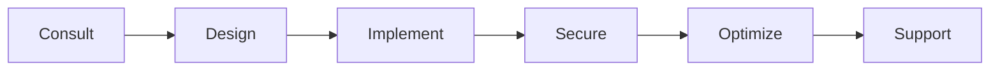

# Welcome to matf0r 👋

## 🚀 Your Partner in Digital Excellence

We are **matf0r** - a specialized technology company delivering cutting-edge solutions in software development, cloud architecture, DevOps, Kubernetes, and cyber security.

---

## 💡 What We Do

### 🔧 Software Development
Building robust, scalable, and innovative software solutions tailored to your business needs. From concept to deployment, we turn your ideas into reality.

### ☁️ Cloud Architecture
Designing and implementing cloud-native solutions that are secure, resilient, and cost-effective. We help you leverage the full power of cloud computing.

### ⚙️ DevOps & Automation
Streamlining your development lifecycle with modern DevOps practices, CI/CD pipelines, and infrastructure automation to accelerate delivery and improve quality.

### ☸️ Kubernetes & Container Orchestration
Expert implementation and management of Kubernetes clusters, container strategies, and microservices architectures for scalable and reliable systems.

### 🔒 Cyber Security
Protecting your digital assets with comprehensive security solutions, from vulnerability assessments to security architecture design and implementation.

---

## 🎯 Our Approach

We follow a comprehensive approach that ensures your solutions are not only built right but also secure, optimized, and sustainable for the long term.

---

## 🛠️ Technologies We Work With

---

## 📊 Why Choose matf0r?

<table>
<tr>
<td align="center">
<h3>🎓 Expertise</h3>
Deep technical knowledge across multiple domains
</td>
<td align="center">
<h3>⚡ Agility</h3>
Fast adaptation to changing requirements
</td>
<td align="center">
<h3>🔐 Security First</h3>
Security integrated at every step
</td>
</tr>
<tr>
<td align="center">
<h3>📈 Scalability</h3>
Solutions that grow with your business
</td>
<td align="center">
<h3>🤝 Partnership</h3>
Long-term collaboration and support
</td>
<td align="center">
<h3>💡 Innovation</h3>
Latest technologies and best practices
</td>
</tr>
</table>

---

## 🌟 Let's Build Something Great Together

We're passionate about helping businesses transform their technology landscape. Whether you need to modernize your infrastructure, secure your systems, or build innovative solutions - we're here to help.

### 📫 Get In Touch

**Ready to start your next project?**

Explore our repositories to see our work, or reach out to discuss how we can help you achieve your goals.

---

Built with ❤️ by matf0r team

